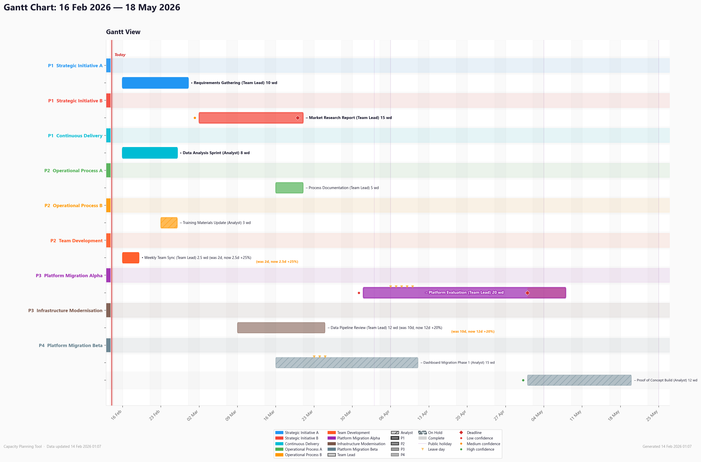
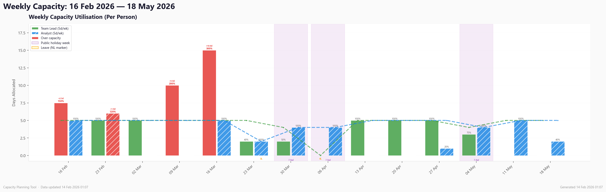
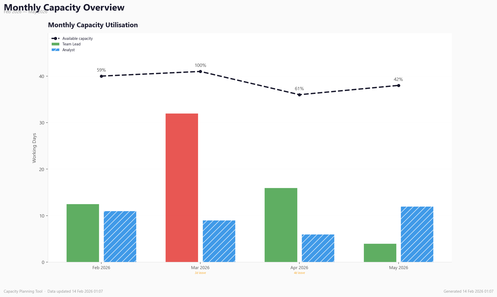
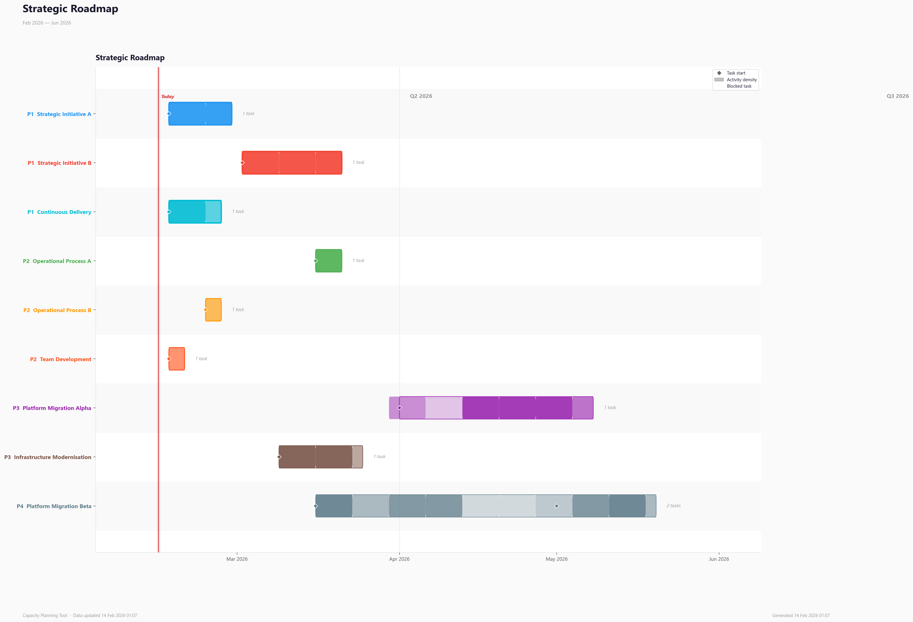

# Capacity Planning Tool

A Python tool for visualising team workload and capacity. Reads work requests from an Excel file, calculates weekly and monthly capacity, and outputs professional presentation-ready charts as PNGs. Supports public holidays, annual leave, deadlines, and risk/confidence tracking.

## Why I Built This

On any given week I'm juggling around 10 concurrent tasks while managing a small team. My leadership team wanted clearer visibility on capacity, timelines, and long-term planning, but building slides and reports every week would add too much extra overhead. We already track work in Jira, but they wanted Gantt charts, capacity views, and a roadmap. So I built a tool to bridge that gap. All I need to do now is update one spreadsheet and the script generates everything in seconds.

## What It Generates

### 1. Gantt Chart (`capacity_gantt.png`)
- Tasks grouped by workstream, sorted by priority (P1 first). Colour-coded rounded bars with hatch patterns per team member.
- Priority badges on workstream headers. Status symbols, estimation drift labels (coloured amber/green), planned-vs-actual ghost bars for completed tasks.
- Weekend shading (light grey bands), public holiday dotted lines, and per-person leave markers (triangles).
- Deadline diamond markers (red) with red-tinted overshoot when a task extends past its deadline.
- Confidence dots next to task labels - green (High), amber (Medium), red (Low).
- Long task names automatically truncated to keep the chart readable.



### 2. Weekly Capacity (`capacity_weekly.png`)
- Per-person side-by-side bars showing days allocated per week.
- Individual per-person capacity lines (dip during leave/holiday weeks).
- Public holiday week shading, leave markers per person.
- Over-capacity bars highlighted in red with overshoot annotation (e.g. "+1.5d").
- Utilisation percentage labels per person.



### 3. Monthly Capacity Overview (`capacity_monthly.png`)
- Side-by-side bars per team member showing days allocated per month.
- Available capacity line (adjusts for working days, public holidays, and leave).
- Utilisation percentage labels. Per-person over-capacity highlighting in red.
- Leave day annotations on months with significant leave.



### 4. Strategic Roadmap (`roadmap.png`)
- Swim-lane view with one bar per workstream, sorted by priority (P1 at top).
- Priority badges on y-axis labels. Activity density shading.
- Diamond markers at each task start. Blocked task warning markers. Quarter boundary lines.
- Designed for exec-level conversations.



### Console Output
- **Executive summary**: task counts, public holiday count, leave-adjusted utilisation per person, over-capacity weeks with per-person detail, leave summary with types, priority breakdown, estimation drift totals, deadline warnings, low-confidence task flags, concurrent task warnings
- **Schedule suggestions**: early finishers, overdue tasks, blocked duration, leave overlaps, spare capacity gaps
- **Output file list**: which PNGs were written

```
============================================================
  EXECUTIVE SUMMARY
============================================================
  Tasks:         10 total (10 active, 0 complete, 0 on hold)
  Timeline:      14 weeks
  Public holidays: 3 in timeline period
  Utilisation:   81% overall
    Team Lead: 64.5 / 63 days (102%)
    Analyst: 38.0 / 64 days (59%)
  Over-capacity: 3 of 14 weeks
    Team Lead: w/c 17 Feb (6.5d vs 5.0d), w/c 24 Feb (5.5d vs 5.0d)
    Analyst: w/c 03 Mar (5.5d vs 5.0d)

  Leave:
    Team Lead: 5d Annual Leave (06 Apr - 10 Apr)
    Analyst: 3d Training (23 Mar - 25 Mar)

  By priority:
    P1: 4 tasks (53 days)
    P2: 3 tasks (19.5 days)
    P3: 2 tasks (18 days)
    P4: 1 task (12 days)

  Estimation drift: +2.5 days (+21%) across 2 tasks - scope increase
============================================================

SCHEDULE SUGGESTIONS:
  Team Lead has 5 leave day(s) during 'Platform Evaluation' (06 Apr - 10 Apr)
  Analyst has spare capacity in w/c 02 Mar (0.0 days allocated, 5.0 days free)
  ...

  Output:
    output/capacity_gantt.png
    output/capacity_weekly.png
    output/capacity_monthly.png
    output/roadmap.png
    output/summary.txt
```

## Setup

### Requirements
- Python 3.10+
- matplotlib, numpy, openpyxl, pandas, pytest

### Install Dependencies
```bash
pip install -r requirements.txt
```

## Usage

### 1. Generate the Excel Template
```bash
python capacity_planner.py --template
```
Creates `capacity_data.xlsx` with five sheets and example data:
- **Team** - team members and available days per week
- **Workstreams** - workstream names, display colours, and priorities (P1-P4)
- **Tasks** - tasks with workstream, assignee, dates, estimates, priority, status, deadline, confidence, and more
- **Public Holidays** - dates that affect all team members (e.g. bank holidays)
- **Leave** - per-person leave with date ranges, type, and notes

The template includes:
- **Dropdown validations** for Status, Priority, Workstream, Assigned To, Leave Type, and Confidence
- **Conditional formatting** for status colours, priority emphasis, scope drift highlighting, leave type colours, and confidence colours
- **Frozen headers** on all sheets

### 2. Edit the Excel File
Open `capacity_data.xlsx` and update with your actual tasks and team info.

**Only 6 mandatory fields per task:** Task, Workstream, Assigned To, Start Date, Total Days, Status. Everything else is optional or auto-filled.

**Status values:** `Planned`, `In Progress`, `Complete`, `On Hold`

**Priority values:** `P1`, `P2`, `P3`, `P4` (blank = inherits from workstream)

**Total Days:** working days the task takes (supports fractions like 2.5). Distributed across weekdays automatically, skipping weekends and holidays/leave.

**Original Days:** the initial estimate - auto-fills from Total Days if left blank. Only update Total Days as scope changes to track estimation drift.

**Deadline:** (optional) hard date - shows red diamond on Gantt, console warning if task overshoots.

**Confidence:** (optional) `High`, `Medium`, or `Low` - shows coloured dot on Gantt, flags low-confidence tasks in console.

**Actual End:** (optional) date a Complete task actually finished. Shows planned-vs-actual comparison on the Gantt.

**Blocked By:** (optional) free text explaining what's blocking the task. Works with any status - On Hold tasks show blocked duration, Planned/In Progress tasks show a BLOCKED warning in schedule suggestions and on the Gantt.

**Leave Types:** `Annual Leave`, `Sick`, `Training`, `Conference`, `Other`

### 3. Generate Charts
```bash
# Generate all charts (default - 4 PNGs)
python capacity_planner.py

# Generate specific charts only
python capacity_planner.py --charts gantt
python capacity_planner.py --charts weekly monthly
python capacity_planner.py --charts monthly roadmap

# Custom output directory (affects all charts)
python capacity_planner.py --outdir path/to/reports/

# Date window filter (only tasks overlapping with the range)
python capacity_planner.py --from 2026-04-01 --to 2026-06-30

# Custom input file
python capacity_planner.py --input path/to/file.xlsx

# Combine options
python capacity_planner.py --charts gantt weekly --outdir reports/ --from 2026-04-01
```

## Features

### Smart Defaults (Ease of Use)
Adding a new task requires only **6 fields**: Task, Workstream, Assigned To, Start Date, Total Days, Status. Everything else is optional:
- **Priority** inherits from the workstream if left blank - only fill when a task differs
- **Original Days** auto-fills from Total Days if left blank - drift tracking activates automatically when you later update Total Days
- Deadline, Confidence, Actual End, Blocked By, Notes - fill only when relevant

### Priority System (P1-P4)
- Both workstreams and tasks have priorities
- Gantt and roadmap sort by workstream priority, then task priority within each group
- Visual weight varies: P1 = bold/thick/full opacity, P4 = thin/faded
- Priority badges on workstream headers

### Deadline & Confidence (Communication Tools)
- **Deadline**: optional hard date for tasks with firm delivery expectations
  - Red diamond marker on the Gantt at the deadline position
  - Red-tinted overshoot if the task bar extends past the deadline
  - Console warning: `"Platform Migration ends 3 days after deadline"`
- **Confidence**: optional High/Medium/Low rating for estimate quality
  - Coloured dot on Gantt: green (High), amber (Medium), red (Low)
  - Low-confidence tasks flagged in console output
- Both are communication tools for managing expectations - fill only for the 2-3 tasks where it matters

### Public Holidays & Leave
- **Public Holidays sheet** (optional): dates that affect all team members - tasks schedule around them
- **Leave sheet** (optional): per-person leave with date ranges and type
- Tasks automatically extend around leave/holiday periods (treated like weekends)
- Capacity calculations adjust for reduced availability
- Both sheets are **backwards compatible** - if missing, the tool works identically to before
- Visual indicators: holiday dotted lines on Gantt, leave triangle markers, capacity line dips, holiday week shading on weekly chart
- Leave summary in executive summary shows per-person leave with types

### Estimation Drift Tracking
- Original Days vs Total Days shows scope changes
- Drift labels on Gantt bars: "(was 10d, now 15d +50%)" - coloured amber (increase) or green (decrease)
- Executive summary totals across all drifted tasks

### Planned vs Actual
- Complete tasks with an Actual End date show two overlapping bars on the Gantt:
  - Ghost/dashed bar at planned position
  - Solid bar at actual position
  - Variance label: "+3d late" (red) or "-2d early" (green)

### Blocked/On Hold Tracking
- On Hold tasks shown in neutral blue-grey with cross-hatch pattern and dashed border - visually distinct from active work
- Planned tasks rendered at reduced opacity vs In Progress for clear status hierarchy
- Blocked duration calculated and displayed (no artificial cap - a task can be blocked longer than its estimate)
- Blocked By reason shown if provided
- Warning markers on roadmap for workstreams with blocked tasks

### Schedule Suggestions
- Early finishers: recommends pulling forward subsequent tasks
- Overdue warnings for In Progress tasks past their planned end
- Blocked duration tracking (On Hold tasks)
- Blocked task warnings (Planned/In Progress tasks with Blocked By filled)
- Leave overlap warnings (person has leave during an active task)
- Spare capacity alerts for future weeks (uses leave-adjusted availability)
- Concurrent task warnings (3+ tasks per person in the same week)

### Fractional Days
- Total Days and Original Days support decimals (0.5, 1.5, 2.5, etc.)
- Capacity calculations sum fractional allocations correctly

### Date Window Filtering
- `--from` and `--to` flags filter tasks to only those overlapping the specified date range
- Useful for generating a "next quarter" or "this month" view

## Data Validation

The tool validates your Excel data before generating charts:
- Checks for missing required columns with clear error messages
- Non-positive durations are warned and the task is skipped
- Detects workstream name mismatches with fuzzy suggestions (using `difflib`)
- Validates assigned team members against the Team sheet
- Validates hex colour codes on workstreams
- Invalid status values cause an error (valid: Planned, In Progress, Complete, On Hold)
- Warns on unrecognised priority values
- Warns if task priority is higher than its workstream priority
- Validates deadlines (warns if deadline is before start date)
- Validates leave person names match the Team sheet
- Warns if a public holiday falls on a weekend
- Detects duplicate names in Team and Workstreams sheets (warns and keeps first occurrence)
- Detects file lock (Excel open) with actionable "close the file" message
- Post-schedule integrity check (end date before start date)

## Testing

The test suite covers 157 tests across 6 tiers, built from 42 bugs found and fixed across 20 rounds of code review:

1. **Pure unit tests** - date parsing, string cleaning, priority sorting, working-day calculations
2. **Function-level tests** - schedule calculation, capacity allocation, leave/holiday handling
3. **Integration tests** - Excel I/O round-trips (template generation, data loading, validation)
4. **End-to-end tests** - full pipeline from Excel input to chart output
5. **Edge cases** - empty inputs, boundary dates, fractional days, NaN handling
6. **Regression tests** - specific bugs caught during development, including interaction effects between features

See [QA & Testing](QA_AND_TESTING.md) for the full review process, bug family analysis, and testing methodology.

### Run Tests
```bash
pytest test_capacity_planner.py -v
```

## File Structure
```
capacity_planner.py        # Single script - all logic
test_capacity_planner.py   # Test suite (157 tests, 6 tiers)
QA_AND_TESTING.md          # Review process, bug analysis, testing methodology
capacity_data.xlsx         # Excel input (generated via --template, then user-maintained)
requirements.txt           # pip install -r requirements.txt
examples/                  # Example chart output (from template data)
  capacity_gantt.png
  capacity_weekly.png
  capacity_monthly.png
  roadmap.png
output/                    # Your generated output (gitignored)
  capacity_gantt.png
  capacity_weekly.png
  capacity_monthly.png
  roadmap.png
  summary.txt
```
